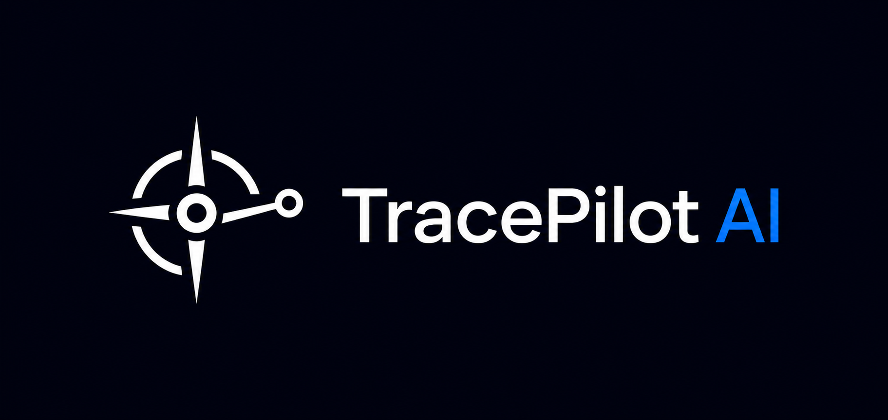

<div align="center">

<!-- Replace with your actual banner image: 1280x640px, dark background -->


<h1>TracePilot AI</h1>

<p><strong>The debugging layer your AI agents have been missing.</strong><br/>
Trace every decision, fork any execution, fix failures in seconds — not hours.</p>

[](https://www.npmjs.com/package/tracepilot-sdk)
[](https://www.npmjs.com/package/tracepilot-sdk)
[](LICENSE)
[](https://www.typescriptlang.org/)

[**Get API Key →**](https://tracepilotai.com) · [Dashboard](https://tracepilotai.com/dashboard) · [Report a bug](https://discord.com/invite/ktYCtCA8D)

</div>

---

## The problem

Your AI agent fails in production. It called GPT-4o 47 times, spent $3.20, and returned garbage. Your logs say `"agent finished"`. You have no idea what happened inside.

Traditional observability tells you *that* something broke. TracePilot lets you **go back in time, change the input at the exact step that failed, and re-run from there** — without redeploying anything.

---

## Demo

<!-- Replace the link below with your actual Loom/YouTube demo URL -->
<!-- Recommended: 60-90 second screen recording showing the Fork & Rerun flow -->

[](https://www.youtube.com/watch?v=YOUR_VIDEO_ID)

> *60 seconds: an agent fails, we fork the broken span, edit the prompt, and rerun live.*

---

## How it works

You wrap your OpenAI calls with TracePilot. That's it.

Every LLM call, every tool invocation, every token spent — captured as a structured trace. When something goes wrong, you open the dashboard, find the failing span, and hit **Fork & Rerun**. Edit the prompt right there. See the new output instantly. No redeployment. No guessing.

```
Your Agent  →  tp.wrapOpenAI()  →  OpenAI API
                     ↓
              TracePilot captures:
              input · output · tokens · latency · errors
                     ↓
              Dashboard: visualize · fork · fix
```

---

## Quickstart

### 1. Install

```bash
npm install tracepilot-sdk
```

### 2. Get your API key

Sign in at [tracepilotai.com](https://tracepilotai.com) with GitHub or Google. Your key looks like:

```
tp_live_xxxxxxxxxxxxxxxx
```

### 3. Wrap your first agent

```ts
import { TracePilot } from 'tracepilot-sdk';
import OpenAI from 'openai';

const tp = new TracePilot('tp_live_YOUR_KEY');
const openai = new OpenAI({ apiKey: process.env.OPENAI_API_KEY });

async function runAgent() {
  await tp.startTrace('customer-support-agent');

  const messages = [
    { role: 'user', content: 'How do I reset my password?' }
  ];

  // One wrapper. Full visibility.
  const { result, spanId } = await tp.wrapOpenAI(
    () => openai.chat.completions.create({ model: 'gpt-4o-mini', messages }),
    messages
  );

  console.log(result.choices[0].message.content);
  // → Open your dashboard. You'll see the full trace.
}

runAgent();
```

Open [tracepilotai.com/dashboard](https://tracepilotai.com/dashboard) — your trace is already there.

---

## Time-Travel Debugging

This is what makes TracePilot different.

When an agent fails, you don't restart from zero. You **fork the execution at the exact failing step**.

```ts
// Multi-step agent with nested tool calls
async function researchAgent(query: string) {
  await tp.startTrace('research-agent');

  const messages = [{ role: 'user', content: query }];

  // Step 1 — Initial reasoning
  const { result: plan, spanId: planSpanId } = await tp.wrapOpenAI(
    () => openai.chat.completions.create({ model: 'gpt-4o', messages }),
    messages
  );

  // Step 2 — Tool call (tracked separately)
  const { result: searchResult, spanId: searchSpanId } = await tp.wrapToolCall(
    'web-search',
    () => webSearch(plan.choices[0].message.content),
    planSpanId,  // parent span — builds the execution tree
    2
  );

  // Step 3 — Final synthesis
  const followUp = [
    ...messages,
    plan.choices[0].message,
    { role: 'tool', content: JSON.stringify(searchResult) }
  ];

  const { result: answer } = await tp.wrapOpenAI(
    () => openai.chat.completions.create({ model: 'gpt-4o', messages: followUp }),
    followUp,
    searchSpanId,  // parent span
    3
  );

  return answer.choices[0].message.content;
}
```

If Step 3 produces a bad answer, open the dashboard → find span 3 → click **Fork & Rerun** → edit the messages → see the new result. **No redeployment. Seconds, not hours.**

---

## Features

| | What it does |
|---|---|
| **Execution Tracing** | Every LLM call and tool invocation captured as a structured span tree |
| **Time-Travel Forking** | Edit any span's input and re-execute from that exact point |
| **Token & Cost Tracking** | Per-span token usage and estimated API cost in real time |
| **Error Spans** | Failures captured automatically with full context |
| **Destructive Call Warnings** | Flag tool calls that modify external state (DB writes, emails, etc.) |
| **Live Dashboard** | Visualize execution trees, latency, RPS — no config needed |

---

## API Reference

### `new TracePilot(apiKey, endpoint?)`

```ts
const tp = new TracePilot('tp_live_YOUR_KEY');
// Custom endpoint for self-hosted:
const tp = new TracePilot('tp_live_YOUR_KEY', 'https://your-server.com/api/ingest');
```

### `tp.startTrace(agentName)`

Starts a new trace session. Call once at the beginning of your agent run.

```ts
await tp.startTrace('my-agent');
```

### `tp.wrapOpenAI(call, messages, parentSpanId?, stepOrder?)`

Wraps any OpenAI chat completion call. Returns the original result untouched plus the `spanId` for building parent-child trees.

```ts
const { result, spanId } = await tp.wrapOpenAI(
  () => openai.chat.completions.create({ model: 'gpt-4o-mini', messages }),
  messages,
  parentSpanId,  // optional — links this span to a parent
  1              // optional — step order in the execution tree
);
```

### `tp.wrapToolCall(toolName, call, parentSpanId, stepOrder, isDestructive?)`

Wraps any tool/function call. Set `isDestructive: true` for operations that modify external state.

```ts
const { result, spanId } = await tp.wrapToolCall(
  'send-email',
  () => sendEmail(to, subject, body),
  parentSpanId,
  2,
  true  // marks this span with a ⚠ Destructive badge in the dashboard
);
```

---

## Works with your existing stack

TracePilot wraps your calls — it doesn't replace them. No lock-in, no SDK sprawl.

- **OpenAI SDK** — `wrapOpenAI`
- **LangChain** — wrap the underlying OpenAI calls
- **CrewAI** — wrap at the agent tool level
- **AutoGen** — compatible with any async call pattern
- **Custom orchestration** — if it's async, you can wrap it

---

## Roadmap

- [x] OpenAI instrumentation
- [x] Tool call tracing
- [x] Time-Travel Forking
- [x] Cost & token tracking
- [ ] Python SDK
- [ ] Semantic caching (automatic 30% cost reduction)
- [ ] Auto-remediation (loop detection + circuit breaker)
- [ ] Golden Traces (behavioral drift alerts)

---

## Contributing

Issues and PRs are welcome. If you're building something with autonomous agents and want to shape the roadmap, [open an issue](https://github.com/TracePilotAI/tracepilot-sdk/issues) or reach out directly.

---

## License

MIT © [TracePilot AI](https://tracepilotai.com)
